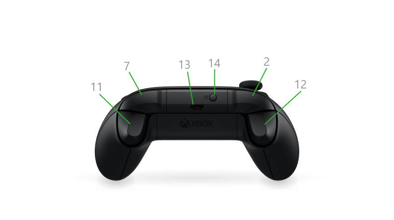

# Xbox Series X|S 手柄背面與頂部

依據 [Xbox 官方組件說明](https://support.xbox.com/zh-HK/help/hardware-network/controller/get-to-know-your-xbox-series-x-s-controller) 整理，核對日期：2026-10-02。以下編號對應本頁圖片。

| 圖中編號 | 組件 | 位置與用途 |
|---|---|---|
| 2 | LB 左肩鍵 | 左扳機上方；按鈕輸入 |
| 7 | RB 右肩鍵 | 右扳機上方；按鈕輸入 |
| 11 | RT 右扳機 | 右肩鍵下方；類比輸入 |
| 12 | LT 左扳機 | 左肩鍵下方；類比輸入 |
| 13 | USB-C 接口 | 頂部中央；官方列為電源／充電接口 |
| 14 | 配對按鈕 | USB-C 旁；用於無線連接與配對 |

**編號依圖解釋：本圖的 11 是 RT，[正面圖](front.md) 的 11 是右搖桿。**
這些編號不是程式中的按鈕／軸索引。

專案已驗證 USB-C 有線連接 Mac 並讀取手柄輸入；LT／RT 在現有檢查程式中作為軸
讀取。配對按鈕屬於連接管理，不列入 ROV 功能分配的候選。

另見：[正面組件](front.md)
