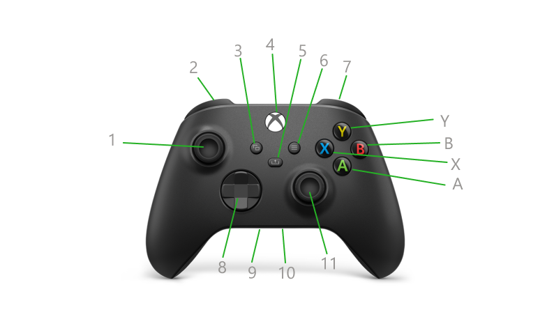

# Xbox Series X|S 手柄正面

依據 [Xbox 官方組件說明](https://support.xbox.com/zh-HK/help/hardware-network/controller/get-to-know-your-xbox-series-x-s-controller) 整理，核對日期：2026-10-02。以下編號對應本頁圖片。

| 圖中編號 | 組件 | 位置與用途 |
|---|---|---|
| 1 | 左搖桿 | 左上方；方向輸入，也可按下 |
| 2 | LB 左肩鍵 | 頂部左側；按鈕輸入 |
| 3 | View 檢視鍵 | Xbox 鍵左下方；用途由應用程式決定 |
| 4 | Xbox 鍵 | 上方中央；電源及系統選單 |
| 5 | Share 分享鍵 | Xbox 鍵下方；遊戲截圖／短片 |
| 6 | Menu 選單鍵 | Xbox 鍵右下方；應用程式選單 |
| 7 | RB 右肩鍵 | 頂部右側；按鈕輸入 |
| 8 | D-pad 方向鍵 | 左下方；上、下、左、右輸入 |
| 9 | 3.5 mm 音訊接口 | 底部；連接音訊裝置 |
| 10 | 擴充接口 | 底部；連接配件 |
| 11 | 右搖桿 | 右下方；方向輸入，也可按下 |
| A / B / X / Y | 面部按鈕 | 右側：A 下、B 右、X 左、Y 上 |

官方香港繁體中文版把音訊接口誤寫為「3.5 公分」，此處修正為 **3.5 mm（毫米）**。

官方對 Xbox／Share 鍵的用途描述是針對相應平台，不代表 Mac 上的控制程式會收到這
些按鍵或執行截圖，需要實測確認。

下一步先列出 ROV 需要的功能、使用頻率、是否需要連續調節，再分配輸入。搖桿按下
也是獨立按鈕，應一併考慮；接口不算可對應的按鍵。

另見：[背面與頂部組件](back.md)
